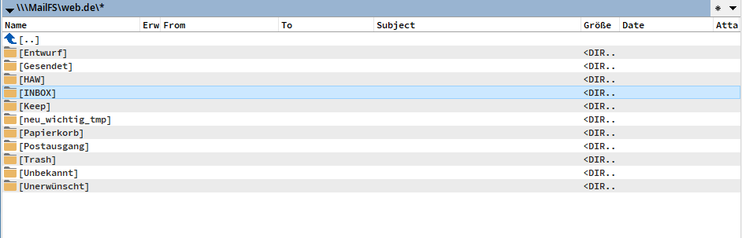
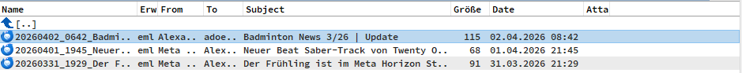
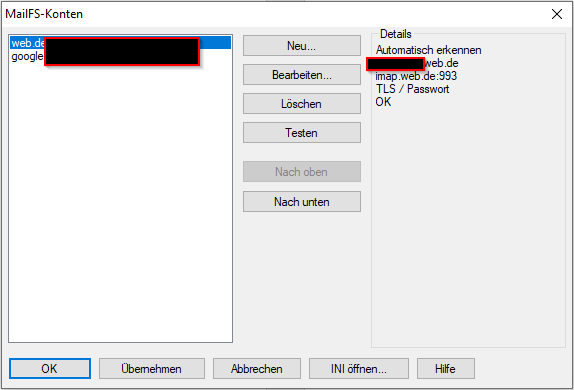

# MailFS – Quick Reference

## Features
- IMAP/POP3 accounts shown as folders in Total Commander; messages as `.eml` files
- Download messages via F5 (copy out as complete EML files)
- Sending mail: **"*** New mail ***"** entry in each account folder opens a
  compose window (To/Cc/Bcc, Subject, body, attachments) and sends via SMTP
- Attach files by copying/dragging them into an account (any folder) –
  opens the compose window with the file(s) already attached
- Address book (shared across accounts): Favorite / Default-per-field
  addresses, auto-recorded on send, auto-pruned to `MaxAddresses`
- Reply via F7: create a "new folder" named exactly like an existing
  message's `.eml` filename (without the extension) → opens a reply
  (RE: subject, To/Cc from the original, quoted body, In-Reply-To/References)
- OAuth2 (Gmail/Outlook/Yahoo) or password auth (Credential Manager only,
  never stored in plaintext)
- Localized UI: German, English, Russian, Ukrainian (auto or fixed)

## Configuration
- `mailfs.ini` next to `mailfs.wfx` — accounts, server/port/encryption,
  visible folders, SMTP settings; no passwords/tokens
- Per account: `[AccountN]` with `ImapServer/Port/Encryption/Username/Auth`,
  `Pop3...` equivalents, `VisibleFolders` (`|`-separated), `SmtpServer/Port/Enc/From/SaveToSent`
- `[Addresses]`: `MaxAddresses` (default 10), then `AddressN` +
  `.Fav`/`.DefTo`/`.DefCc`/`.DefBcc`/`.Tick` per entry
- Passwords/OAuth2 tokens: Windows Credential Manager only
  (`MailFS/{account-id}/{password|oauth2_access|oauth2_refresh}`)
- Language: `Language=auto|de|en|ru|uk` in `[Global]`, set via the
  **MailFS Accounts** dialog's language combo box

## Custom Columns
Set up via **View → Configure custom columns → Add plugin columns → mailfs**.

| Field | Scope | Meaning |
|---|---|---|
| From, To, Sender, Subject, Reply-To | message | standard header fields |
| Received, Sent | message | dates |
| Size | message | message size |
| Attachment | message | has attachment (bool) |
| Mailer, Priority | message | X-Mailer / X-Priority headers |
| Status | message | `new`/`old`/`---` (unread/read/unknown, e.g. POP3) |
| TotalMails, NewMails | **folder row only** | total / unread count (IMAP STATUS); `---` elsewhere |

## Usage
- **Browse:** navigate account → folder → messages appear as `.eml`
- **Open/download:** F5 to copy locally, then open with any EML viewer
- **Test connection:** MailFS Accounts dialog → select account → Test
- **Send:** open "*** New mail ***" → fill in → Send
- **Attach via copy:** drag/copy file(s) into an account folder
- **Address book:** "AB" button next to To/Cc/Bcc in the compose window
- **Reply via F7:** F7 on a message list, type the message's filename
  (without `.eml`) as the new folder name
